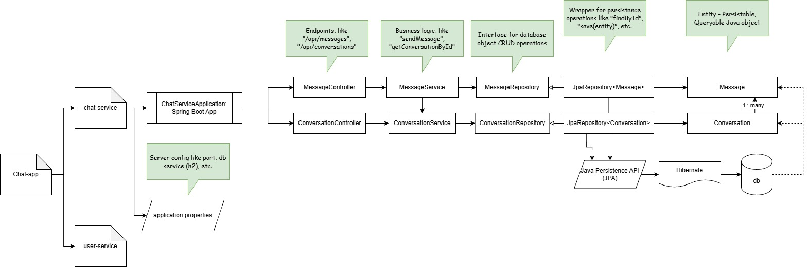

## Backend chat-app

### Root project
`chat-app`: Java project acting as parent Maven project for all microservices.
- Microservices will be added a child maven modules
- `<packaging>pom</packaging>` tells this is not an application project, but a parent project.
- Sprint Boot 3.5.8 Application
  - `4.0.0` has issues with enabling h2-console

### User Service
`chat-app/user-service`: Microservice for user service
- added as child Maven module of root project

### Chat Service
`chat-app/chat-service`: Microservice for chat service
- same setup as user service
- Persistence: JPA (Java Persistence API) + Hibernate
- currently uses `h2` -  in-memory (non-persisting) database. Later replace with `PostgreSQL`.

#### Spring Boot Packages
- `/controller`: REST endpoints
  - `ConversationController`: create conversations, list conversations
  - `MessageController`: send messages, fetch messages
- `/entity`: JPA entities
  - "Message": a typical message
  - "Conversation": list of messages in 1:1 chat
- `/repository`: JPA repository bridges gap between JPA entity and database
  - `ConversationRepository`: Sprint Boot gives methods like `findAll()`, etc.
  - `MessageRepository`: a custom query method
  - All implementation is automatically generated by Spring Boot.
- `/service`: business logic, wrapper around repository and other services
  - `ConversationService`: methods for conversation business logic.
  - `MessageService`: uses ConversationService and MessageRepository.

#### h2-console
Navigate to `http://localhost:8081/h2-console`
- Url: jdbc:h2:mem:chatdb
- Username: sa
- Password: <empty>

It allows one to CRUD h2 database right from browser.
It's helpful in testing.

## End-to-end Testing
Spring Boot tests are located at `<service>/src/test/java/com.example.chat.<service>/*Test.java`.
Some concepts to learn (official guide at https://spring.io/guides/gs/testing-web)-
- `@SpringBootTest`: Tells Spring Boot to look for a main configuration class (one with `SpringBootApplication`) and use that to start a Spring application context.
- `@Test`: for an individual test
- `@Autowired`: Spring Boot injects the object as test dependency BEFORE running any test. `contextLoads` is such a smoke test that checks controller is not null.
  - `MockMvc`: for running service and call REST endpoints
  - `ObjectMapper`: JSON conversion (`jsonPath`, `readTree`). See [ChatServiceApplicationTest](./chat-service/src/test/java/com/example/chat/chat/ChatServiceApplicationTest.java) for usage.

Spring Boot Test runs the endpoint end-to-end, from starting actual server to creating entry in h2 database.
We can also use Mockito to mock service without running service.
