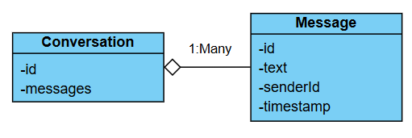

## Backend chat-app

### Root project
`chat-app`: Java project acting as parent Maven project for all microservices.
- Microservices will be added a child maven modules
- `<packaging>pom</packaging>` tells this is not an application project, but a parent project.

### User Service
`chat-app/user-service`: Microservice for user service
- added as child Maven module of root project
- Sprint Boot 4.0.0 Application

### Chat Service
`chat-app/chat-service`: Microservice for chat service
- same setup as user service
- Persistence: JPA (Java Persistence API) + Hibernate
- currently uses `h2` -  in-memory (non-persisting) database. Later replace with `PostgreSQL`.

#### Spring Boot Packages
- `/controller`: REST endpoints
  - `ConversationController`: create conversations, list conversations
  - `MessageController`: send messages, fetch messages
- `/entity`: JPA entities
  - "Message": a typical message
  - "Conversation": list of messages in 1:1 chat
- `/repository`: JPA repository bridges gap between JPA entity and database
  - `ConversationRepository`: Sprint Boot gives methods like `findAll()`, etc.
  - `MessageRepository`: a custom query method
  - All implementation is automatically generated by Spring Boot.
- `/service`: business logic, wrapper around repository and other services
  - `ConversationService`: methods for conversation business logic.
  - `MessageService`: uses ConversationService and MessageRepository.
